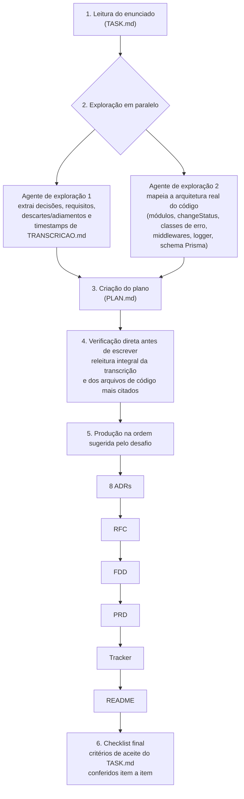

<!-- TOC -->

- [Sistema de Webhooks de Notificação de Pedidos — Pacote de Design Docs](#sistema-de-webhooks-de-notificação-de-pedidos--pacote-de-design-docs)
  - [Sobre o Desafio](#sobre-o-desafio)
  - [Ferramentas de IA Utilizadas](#ferramentas-de-ia-utilizadas)
  - [Workflow Adotado](#workflow-adotado)
  - [Prompts Customizados](#prompts-customizados)
  - [Iterações e Ajustes](#iterações-e-ajustes)
  - [Como Navegar a Entrega](#como-navegar-a-entrega)
  - [Developer](#developer)
  - [License](#license)

<!-- TOC -->

# Sistema de Webhooks de Notificação de Pedidos — Pacote de Design Docs

> O enunciado original do desafio (contexto, requisitos e critérios de aceite) está preservado em [`TASK.md`](./TASK.md). Este README documenta o **processo de produção** do pacote de documentação, não o desafio em si.

## Sobre o Desafio

O desafio consiste em transformar a transcrição literal de uma reunião técnica (`TRANSCRICAO.md`) e o código de um Order Management System já existente em um pacote completo de design docs — PRD, RFC, FDD, ADRs e um Tracker de rastreabilidade — para uma feature ainda não implementada: um sistema de webhooks outbound que notifica clientes B2B sobre mudanças de status de pedidos.

A restrição central do exercício é a rastreabilidade: nenhuma informação registrada nos documentos pode ser inventada — tudo precisa ser atribuível a uma fala específica da transcrição (com timestamp) ou a um arquivo real do código-base. O código da aplicação (`src/`, `prisma/`, `tests/`) não pode ser alterado; a entrega é puramente documental.

## Ferramentas de IA Utilizadas

- [**Claude Code**](https://claude.com/product/claude-code) (com subagentes especializados) — ferramenta principal e única usada na produção deste pacote. Foi usada para: 

  1. explorar em paralelo a transcrição completa e a arquitetura do código-base antes de escrever qualquer documento;
  2. sintetizar um plano de produção concreto, documento por documento, seção por seção;
  3. redigir os 8 ADRs, o RFC, o FDD, o PRD e o Tracker;
  4. verificar diretamente contra o sistema de arquivos que todo caminho de código citado nos documentos existe de fato, evitando alucinação de nomes de arquivo.

## Workflow Adotado

1. **Leitura do enunciado**: leitura de `TASK.md` para mapear os documentos exigidos e os critérios de aceite item a item.
2. **Exploração em paralelo**: dois agentes de exploração rodaram simultaneamente — um extraiu da `TRANSCRICAO.md` todas as decisões, requisitos, itens descartados/adiados, alternativas e questões em aberto, sempre com timestamp `[hh:mm] Nome`; outro mapeou a arquitetura real do código (módulo de pedidos, máquina de estados, transação de `changeStatus`, classes de erro, middlewares, logger, schema Prisma), com caminhos de arquivo exatos.
3. **Criação do plano**: um terceiro passo consolidou as duas explorações em um plano de produção concreto — que decisões viram ADR, que seções cada documento cobre, que endpoints entram no FDD, como o Tracker seria mantido como log corrido em vez de reconstruído de memória no final.
4. **Verificação direta antes de escrever**: antes de redigir qualquer documento, reli a transcrição na íntegra e os arquivos de código mais citados (`order.service.ts`, `http-errors.ts`, `auth.middleware.ts`, `error.middleware.ts`, `schema.prisma`, entre outros) diretamente, em vez de confiar apenas nos resumos dos agentes de exploração.
5. **Produção na ordem sugerida pelo desafio**: 8 ADRs primeiro (esqueleto de decisões) → RFC (consolidação arquitetural, linkando os ADRs) → FDD (detalhamento profundo de implementação) → PRD (consolidação de produto, escrito por último entre os três grandes documentos) → Tracker (montado como varredura estruturada sobre os documentos já prontos, com validação numérica via `grep`) → README (este documento, escrito por último).
6. **Checklist final**: conferência item a item dos critérios de aceite do `TASK.md` contra os arquivos finais antes de considerar a entrega concluída.

O workflow pode ser visualizado no seguinte diagrama:



## Prompts Customizados

Prompt usado para minerar a transcrição com disciplina de timestamp e sem inferir requisitos não ditos:

```
Leia a transcrição completa em TRANSCRICAO.md (formato [hh:mm] Nome: fala).
Extraia, sempre citando o timestamp exato e o falante:
1. Toda decisão técnica fechada
2. Todo requisito funcional explícito
3. Toda alternativa discutida e explicitamente descartada, com o motivo do descarte
4. Todo item adiado para fase futura, com o motivo
5. Toda questão deixada em aberto ao final da reunião
6. Toda menção a reaproveitamento de código/padrões existentes

Não infira requisitos que não foram ditos. Se algo for ambíguo, marque como
ambíguo em vez de resolver silenciosamente.
```

Prompt usado para checar consistência entre a documentação gerada e o código real, base do processo de verificação que evitou caminhos de arquivo fictícios no FDD e nos ADRs:

```
Para cada caminho de arquivo citado em docs/FDD.md e docs/adrs/*.md, confirme
que ele existe literalmente no repositório (leia o arquivo ou use grep, não
confie em memória).

Para cada afirmação sobre comportamento de código (ex: "OrderService.changeStatus
faz X"), cite a linha real do arquivo que sustenta a afirmação.

Sinalize qualquer arquivo, função ou classe mencionada que não exista no
repositório.
```

## Iterações e Ajustes

- **`docs/adrs/README.md` desatualizado**: o arquivo de instruções dentro de `docs/adrs/` orientava nomear ADRs como `0001-titulo.md` (sequência numérica sem prefixo), o que contradizia diretamente o formato `ADR-NNN-titulo-em-kebab-case.md` exigido pelo `TASK.md` e efetivamente usado nos 8 ADRs produzidos. Esse arquivo foi corrigido e recebeu um índice com links para os 8 ADRs, eliminando uma inconsistência que um revisor notaria de imediato.
- **Validação numérica do Tracker em vez de inspeção visual**: em vez de assumir por leitura que a cobertura de 80%, a proporção de 70% de linhas com Fonte `TRANSCRICAO` e o mínimo de 5 linhas com Fonte `CODIGO` estavam corretos, rodei comandos `grep` sobre `docs/TRACKER.md` para contar objetivamente as 117 linhas produzidas (94 `TRANSCRICAO`, 23 `CODIGO`) e validar o formato `[hh:mm] Nome` de cada timestamp — abordagem que teria sinalizado qualquer desvio de formato antes da entrega, não depois.
- **Verificação de existência de cada caminho de código citado**: após montar o Tracker, cada um dos 12 caminhos distintos com Fonte `CODIGO` foi testado individualmente contra o sistema de arquivos real (não contra a memória do que havia sido lido antes), confirmando que nenhum arquivo mencionado nos documentos é fictício.
- **Disciplina contra métricas inventadas**: ao escrever o PRD, a única meta quantitativa registrada foi a de latência (<10s, citada explicitamente na reunião); foi feita a escolha deliberada de não incluir metas adicionais plausíveis mas não discutidas (como uma taxa de sucesso de entrega em %), registrando essa decisão no próprio PRD como salvaguarda contra alucinação.

## Como Navegar a Entrega

Ordem sugerida de leitura, do mais fundamental ao mais consolidado:

1. [`TRANSCRICAO.md`](./TRANSCRICAO.md) — fonte primária, gravação literal da reunião (não alterada).
2. [`docs/adrs/`](./docs/adrs/) — as 8 decisões arquiteturais que formam o esqueleto da feature.
3. [`docs/RFC.md`](./docs/RFC.md) — proposta técnica consolidada, alternativas descartadas e questões em aberto.
4. [`docs/FDD.md`](./docs/FDD.md) — especificação de implementação: fluxos, contratos HTTP, matriz de erros, integração com o código existente.
5. [`docs/PRD.md`](./docs/PRD.md) — visão de produto: problema, escopo, requisitos, riscos e critérios de aceitação.
6. [`docs/TRACKER.md`](./docs/TRACKER.md) — referência cruzada de todo item registrado nos documentos acima à sua origem na transcrição ou no código.
7. Este `README.md` — processo de produção.

O código da aplicação (`src/`, `prisma/`, `tests/`) permanece inalterado e serve apenas como referência para os documentos acima.

## Developer

Aecio dos Santos Pires
- Linkedin: https://www.linkedin.com/in/aeciopires/
- Site: http://aeciopires.com/

## License

MIT License